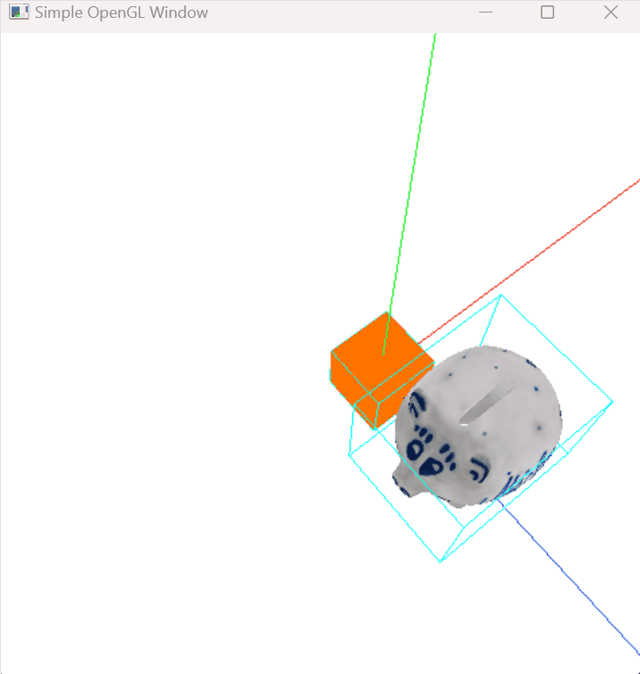

# Advanced Computer Graphics HW2

3D 모델 렌더링 및 텍스처 매핑을 구현한 OpenGL 프로젝트입니다.



## 🎮 조작 방법

### 키보드: 카메라 이동
- **D / A**: X축 이동 (좌/우)
- **Q / E**: Y축 이동 (위/아래)  
- **W / S**: Z축 이동 (앞/뒤)

### 마우스: 회전
- **빈 공간에서 드래그**: 카메라 회전
- **물체를 클릭 후 드래그**: 선택한 물체 회전

## 🖼️ 화면 요소

- **좌표축**: 
  - 🔴 빨강: X축
  - 🟢 초록: Y축  
  - 🔵 파랑: Z축
- **하늘색 박스**: 바운딩 박스 (마우스 클릭 감지를 위한 박스)

## 📁 프로젝트 구조

### 소스 코드
- `Sample_main.cpp`: 메인 렌더링 로직
- `VertexShader.txt`: 정점 셰이더
- `FragmentShader.txt`: 프래그먼트 셰이더
- `stb_image.h`: 이미지 로딩 라이브러리

### 3D 모델 파일
- `cube.obj` / `cube.mtl`: 큐브 모델
- `PiggyBank.obj` / `PiggyBank.mtl`: 돼지 저금통 모델
- `PiggyBankUVTex.png`: 돼지 저금통 텍스처

### 결과 이미지
- `HW2_Result1.png`, `HW2_Result2.png`, `HW2_Result3.png`: 실행 결과 스크린샷

## 🔧 빌드 및 실행

### 처음 클론할 때
```bash
git clone --recurse-submodules https://github.com/your-username/AdComputerGraphicsHW2.git
```

### 이미 클론했다면 서브모듈 초기화
```bash
git submodule update --init --recursive
```

### 빌드
1. Visual Studio에서 `ACG_HW2.sln` 열기
2. 빌드 후 실행
3. 모든 라이브러리가 자동으로 포함됨 (GLM, FreeGLUT, GLEW)

## ✨ 주요 기능

- **3D 모델 렌더링**: OBJ 파일 파싱 및 렌더링
- **텍스처 매핑**: PNG 텍스처 로딩 및 적용
- **MTL 파일 지원**: 재질 속성 읽기
- **바운딩 박스**: 마우스 클릭 감지를 위한 3D→2D 변환
- **인터랙티브 카메라**: 자유로운 시점 이동 및 회전
- **개별 객체 회전**: 각 모델을 독립적으로 회전 가능